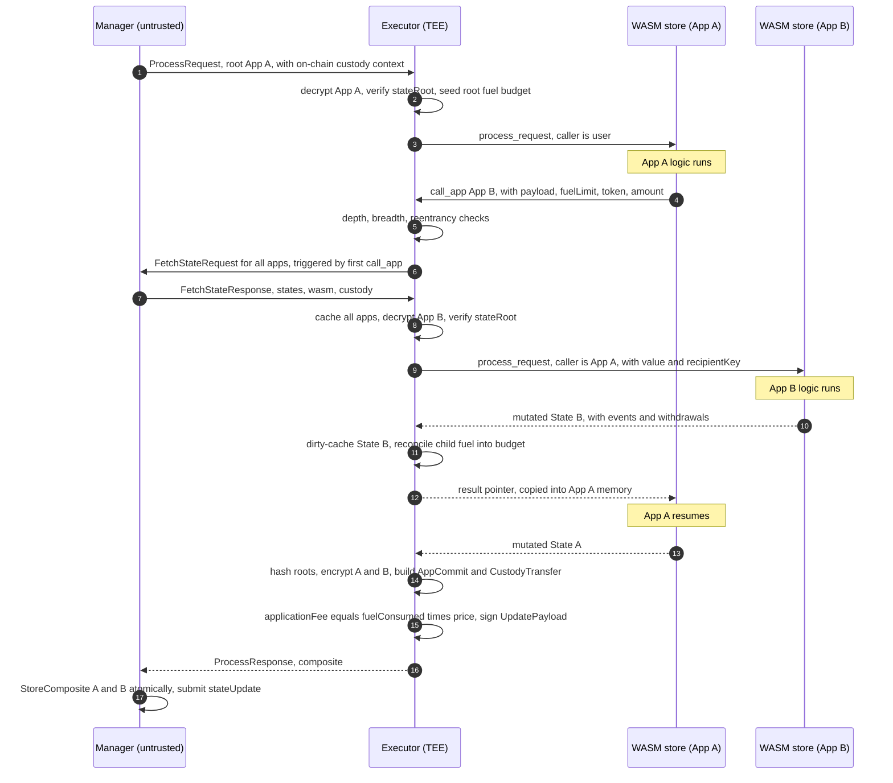

# Vela Composability — Design Spike

> **Status: Proposed (spike).** A buildable design for introducing Ethereum-style
> cross-application composability to the Horizen Privacy-Preserving Execution
> System (PES, codename *Vela*). It is a design document (intent) that builds on
> Vela's current implementation; it is not itself an as-built reference.

## Contents

- [Overview](#overview)
- [1. Execution model: Just-in-Time (JIT) state fetching](#1-execution-model-just-in-time-jit-state-fetching)
- [2. Communication protocol extensions](#2-communication-protocol-extensions)
- [3. Authentication & the guest ABI](#3-authentication--the-guest-abi)
- [4. Reentrancy, errors & atomic rollback](#4-reentrancy-errors--atomic-rollback)
- [5. Native fuel metering](#5-native-fuel-metering)
- [6. State commitment: atomic multi-app on-chain updates](#6-state-commitment-atomic-multi-app-on-chain-updates)
- [7. Resource & execution limits](#7-resource--execution-limits)
- [8. System-wide component modifications](#8-system-wide-component-modifications)
- [9. Open questions / unresolved](#9-open-questions--unresolved)
- [10. Scope summary](#10-scope-summary)
- [11. Implementation cost & sequencing](#11-implementation-cost--sequencing)
- [Appendix A — Call-graph privacy: threat, mechanism, and limits](#appendix-a--call-graph-privacy-threat-mechanism-and-limits)
- [Appendix B — Cross-app custody enforcement](#appendix-b--cross-app-custody-enforcement)
- [Appendix C — Reentrancy: what the ban costs](#appendix-c--reentrancy-what-the-ban-costs)

## Overview

Today Vela enforces strict multi-tenant isolation: each WASM guest runs as a pure,
sandboxed state transition that can only see its own decrypted state. This design
safely opens that sandbox so applications can **synchronously call one another**
(App A invokes App B), enabling DeFi routing, aggregators, and modular logic, while
preserving the integrity and confidentiality guarantees of the Trusted Execution
Environment (TEE).

Throughout, **v1** is the scope this spike fully specifies and intends to build now;
**v2** labels deliberately deferred extensions — mentioned where they shape a v1
decision, but not designed here.

Two capabilities are explicitly **in scope for v1**:

- **Cross-app value transfer.** `call_app` carries value; app-level custody moves
  are committed atomically on-chain (not logic-only).
- **Call-graph privacy.** The cross-app routing is hidden from the untrusted
  Manager with a concrete mitigation (not merely accepted as a leak).

### Current baseline this design modifies

- **Single global FIFO queue.** `ProcessorEndpoint` orders all requests; the
  Executor processes one head request at a time, and `stateUpdate` is **single-app**.
- **Bidirectional transport, but no mid-request callback.** The Manager↔Executor
  channel is bidirectional and the `ClientRequestHandler` interface exists, but it
  is used **only** for the connection-setup handshake. Calling back to the Manager
  *inside an in-flight request* is new control flow.
- **No fuel metering.** The Wasmtime engine uses the default config; guests
  self-report a `fuel` value in their result structs.
- **No per-`Store` memory ceiling.** A guest OOM would `SIGKILL` the Executor past
  the host panic shield.
- **Single-app-atomic storage.** `DataLayer.Store`/`StoreWithWasm` persist one
  app's state+wasm atomically; `Rollback` is per app. No N-app atomic write exists.
- **Per-app funds.** `appCustody[appId][token]`, `totalAppCustody[token]`,
  `pendingClaims[token][payee]`, `totalPendingClaims[token]`; withdrawals are
  `(tokenAddress, receiver, amount)`; solvency is checked per asset.
- **State root = `SHA256(serialized AppData)`**, with per-app version chains and a
  monotonic nonce in `AppData`.

Native fuel metering and per-`Store` memory ceilings (below) are therefore both new
infrastructure that this work introduces.

**Actors & trust (recap).** The **Manager is the operator's single off-chain
component.** Per Vela's trust model it is **untrusted for confidentiality and
integrity** — it only ever handles ciphertext, opaque recovery blobs, and signed
results, and the contract re-checks everything the TEE signs — yet the system
already **depends on the operator for liveness**: the Manager alone drives the global
queue and the on-chain submission, so the operator can stall progress simply by not
submitting. Throughout, "untrusted Manager" means this *same semi-trusted operator* —
adversarial for what it may read or forge, but already relied upon for progress. That
distinction is what makes the custody-snapshot trade-off in §3.4 / Appendix B
acceptable.

### Assumptions & prerequisites

- **Greenfield — no backward compatibility.** Nothing is in production yet, so this
  design takes breaking changes freely: the `stateUpdate` signature, the WASM ABI, and
  the storage layer all change in place, with **no dual-ABI, legacy-app, or
  state-migration machinery**. `ProcessorEndpoint` is non-upgradeable (constructor, no
  proxy) — it is simply redeployed; there is no production state to migrate.
- **Wasmtime upgrade is required.** The runtime currently pins **`wasmtime-go v1.0.0`**,
  which predates the APIs this design needs. It must be upgraded to a recent major
  (e.g. `wasmtime-go/v42`), which provides `config.SetConsumeFuel(true)` (native fuel
  metering, §5), per-`Store` memory limits via the store `Limiter` (§7.3), and
  `config.SetEpochInterruption(true)` + `engine.IncrementEpoch()` (the mechanism for the
  execution deadline, §7.4). The major-version jump changes the import path and API, so
  re-fitting `pkg/wasm` to the new wasmtime is itself a prerequisite work item.
- **Relaxes a core platform invariant.** Composability deliberately relaxes Vela's
  **per-application isolation** guarantee — today an app can only ever see its own
  decrypted state. That invariant must be revised when this ships.

---

## 1. Execution model: Just-in-Time (JIT) state fetching

To give developers a true "Lego block" experience, Vela uses **synchronous JIT
state fetching**. Developers do not pre-declare which apps a transaction will
touch; cross-app routing is resolved dynamically at runtime over the
Manager–Executor connection.

### 1.1 Sequence



App A is naturally suspended while the host `call_app` trap runs App B — it is a
host call that does not return until the sub-call completes. The diagram shows the
bare execution flow; the `FetchState` step is additionally hardened against
call-graph leakage to the Manager (§2.1).

### 1.2 The dirty-state cache

Because one transaction can touch several apps, the Executor maintains a temporary
in-memory `map[uint64]*DecryptedState` for the lifetime of the root request. If App
A calls App B, and later App C also calls App B, the Executor bypasses the
fetch path and reuses the **mutated** State B from the cache, giving linear,
read-your-writes consistency within the transaction. The cache exists only in TEE
volatile memory and is the foundation of atomic rollback (§4.3).

---

## 2. Communication protocol extensions

JIT fetching adds two message types to the bidirectional JSON protocol. Crucially,
these are **server-initiated, mid-request** messages: the Manager must serve them
while a `ProcessRequest` is still in flight (new control flow for its poll loop).

**`FetchStateRequestMessage` (Executor → Manager)** — batched. For a composite
transaction it requests the **full app set** (fetch-all) so the request is
graph-independent; see §2.1:
```json
{
  "ID": "req-123-fetch-1",
  "Type": "FetchStateRequestMessage",
  "Data": { "ApplicationIDs": [42, 7, 91, 13] }
}
```

**`FetchStateResponseMessage` (Manager → Executor)** — one entry per requested ID:
```json
{
  "ID": "req-123-fetch-1",
  "Type": "FetchStateResponseMessage",
  "Data": {
    "States": [
      {
        "ApplicationID": 42,
        "EncryptedAppData": "<b64>",
        "WASMBytecode": "<b64?>",
        "Custody": { "0x0": "<wei>", "0x<usdc>": "<amount>" }
      }
    ]
  }
}
```
`WASMBytecode` is included only for IDs the Executor flags as a module-cache miss.
`Custody` is the app's current on-chain balances (one entry per allowlisted token
plus ETH `0x0`), used to seed the in-TEE custody tracker (§3.4 / Appendix B). The
**root** app's custody likewise rides in the initial `ProcessRequestMessage` (the
"custody context" in §1.1). The Manager sources these by reading the public
`appCustody[app][token]` getter over the allowlist via its **existing blockchain
client** — the same read path it already uses for `getNextPendingRequest` — so this
adds a read, not new infrastructure. The values are a *pre-transaction* baseline; the
Executor applies intra-transaction transfers on top of it (§1.2).

### 2.1 Call-graph privacy

A naive one-app-per-fetch protocol would reveal the full call graph (`A→B→C`:
apps, order, and depth) in cleartext to the Manager (the operator) — a regression
from Vela's confidentiality posture. Pure JIT leaks incrementally by nature, and
(Appendix A) decoy padding cannot fully fix that for a *multi-round* fetch sequence:
any per-round variation is correlatable across rounds. The only intersection-safe
shape is a **single, graph-independent fetch per transaction**.

**v1: fetch-all.** Because the deployed fleet is small (`maxNumOfApplications`
defaults to 10), a composite transaction **prefetches the entire app set in one
batched round** and serves every `call_app` from the dirty-state cache (§1.2). The
prefetch is triggered **lazily, on the transaction's first `call_app`** — a request
isn't known to be composite until it makes a cross-app call, so a simple single-app
request never prefetches (and never pays `PREFETCH_COST`, §5.2). Every composite
transaction therefore issues the *identical* request — "all apps" — so the Manager
learns nothing about which downstream apps were touched, in what order, or how deep. This is perfect call-graph privacy, intersection-safe by construction, and
needs no decoy-selection logic. Developers still write pure JIT (no pre-declaration);
only the runtime prefetches.

**Scaling boundary.** Fetch-all is O(fleet) per composite transaction, so it is gated
by a configurable `PRIVACY_FETCH_ALL_THRESHOLD` (default ≈ `maxNumOfApplications`).
Above it, pure JIT can no longer guarantee a single round; the fallbacks are bounded
**decoy** fetching (weaker) or an optional **pre-declared candidate set** (restores
single-round privacy by giving up pure JIT for that transaction). Removing the leak
entirely at large fleet sizes is a **v2** concern (PIR/ORAM).

**Residual (v1).** A composite transaction fetches; a simple single-app transaction
does not (its root state ships with the `ProcessRequest`), so the Manager can tell
*whether* a transaction used composability — but not which apps. We accept that. The
deployed-app set is already known to the Manager, so fetch-all reveals nothing new
there.

The full analysis — why decoys leak across rounds, fetch-all, the fallbacks, cost,
and the PIR/ORAM v2 direction — is in **Appendix A**.

---

## 3. Authentication & the guest ABI

A callee must know exactly who invoked it. The host injects an **authentication
envelope** at the cross-app boundary, and (for v1 value transfer) the accompanying
value and the original user's encryption key.

### 3.1 Explicit caller types

To prevent confusion between user addresses (20 bytes) and application IDs (`uint64`
derived from the deploy request ID), the ABI carries an explicit `callerType`:

- `callerType = 0` — caller is a **user**; `caller` points to a 20-byte address.
- `callerType = 1` — caller is an **app**; `caller` points to an 8-byte app ID.

`originalSender` is **always** the 20-byte address of the user who initiated the
root transaction.

**Security invariant:** guest logic must use `callerType`/`caller` for access
control (EVM `msg.sender`), and `originalSender` strictly for accounting and routing
encrypted `UserEvent`s (EVM `tx.origin`).

### 3.2 `process_request` ABI (host → guest)

```c
int32_t process_request(
    int64_t appId,
    int32_t originalSenderPtr, int32_t originalSenderLen,  // 20-byte user (tx.origin)
    int32_t callerType,                                    // 0 = user, 1 = app
    int32_t callerPtr, int32_t callerLen,                  // 20B user | 8B appId (msg.sender)
    int32_t valueTokenPtr, int32_t valueTokenLen,          // accompanying value (§3.4)
    int32_t valueAmountPtr, int32_t valueAmountLen,
    int32_t recipientKeyPtr, int32_t recipientKeyLen,      // originalSender P-521 pubkey (§3.5)
    int32_t requestType,
    int32_t payloadPtr, int32_t payloadLen,
    int32_t statePtr, int32_t stateLen
);
```

### 3.3 `call_app` host export (guest → host)

```c
int32_t call_app(
    int64_t targetAppId,
    int32_t payloadPtr, int32_t payloadLen,
    int64_t fuelLimit,
    int32_t tokenPtr, int32_t tokenLen,     // value-less call: token = 0x0
    int32_t amountPtr, int32_t amountLen    //                  amount = 0
);
```

`call_app` returns an `int32` pointer to a length-prefixed result buffer in the
**caller's** memory (same convention as `process_request` results), so App A reads
App B's return exactly as it reads its own.

**`PROCESS`-only, enforced structurally.** Note `call_app` exposes **no
`requestType`**: the host always invokes the callee's `process_request` with
`requestType = PROCESS` (and `callerType = app`). A guest therefore cannot express a
`DEPLOYAPP`, `ASSOCIATEKEY`, or `DEANONYMIZATION` sub-call — the restriction falls out
of the ABI rather than needing a runtime guard. This is deliberate: each non-`PROCESS`
type carries an on-chain authorization/lifecycle that a sub-call cannot satisfy, so
composability opens the sandbox for **business logic only**, not privileged request
types:

- **`DEPLOYAPP`** — needs `DEPLOYER_ROLE` + a deploy slot + a fingerprint-verified WASM
  artifact + an `applicationId` derived from the on-chain deploy `requestId`; none
  exist mid-execution. A factory pattern (apps deploying apps) is a conceivable **v2**
  extension but would need real design given Vela's heavyweight deploy.
- **`ASSOCIATEKEY`** — registers a *user's own* key; one app registering keys in
  another has no coherent semantics, and the legitimate cross-app need is already met
  by injecting the `originalSender`'s P-521 key into the envelope (§3.5). Permanently
  non-composable.
- **`DEANONYMIZATION`** — authority-gated oversight (`AuthorityRegistry`), encrypted to
  the requesting authority; a sub-call has no authority `msg.sender` to pass the gate
  and no authority recipient, so allowing it would be an authorization/privacy bypass.
  Permanently non-composable.

### 3.4 Cross-app value transfer

App-level custody lives **on-chain** (`appCustody[appId][token]`), not in the TEE,
so a cross-app transfer is *authored* in the TEE but *enforced and applied*
on-chain:

- **Value delivery (envelope, not the `deposit` export).** The `(token, amount)`
  from `call_app` is passed into the callee's `process_request` envelope — *not* its
  `deposit` export, which stays reserved for the user→app on-chain deposit flow. This
  reuses the established split exactly: the guest credits its own internal books from
  the value handed to it (just as `deposit` does today), while the contract owns
  app-level custody. A shared `vela-common-go` helper decodes the envelope value so
  this is not per-app boilerplate. A callee that wants to **reject** incoming value
  simply returns an error — in v1 that hard-reverts the whole transaction, so the
  `CustodyTransfer` never commits. A callee that *silently ignores* nonzero value is
  an app bug: its on-chain custody rises with no matching internal credit, and those
  funds are recoverable only via that app's own logic.
- The Executor records the move in the signed payload as a
  `CustodyTransfer { fromApp, toApp, token, amount }`. On-chain (§6) the contract
  checks `appCustody[from][token] >= amount`, then moves custody from caller to
  callee (`totalAppCustody` is unchanged — funds stay in the contract).
- **Enforcement is two-tier.** The Executor keeps an in-TEE *running custody
  tracker* for the touched apps (seeded from the custody snapshot the Manager
  supplies in the request context) and checks every transfer — and every emitted
  withdrawal — against it **at the `call_app` site, failing fast**: an overspend
  immediately hard-reverts (v1) and is turned into a *signed error* payload. The
  contract remains the **authoritative** gate, re-checking `appCustody[from][token] >= amount`
  per transfer in execution order. The on-chain check is a defense-in-depth backstop,
  **not** the rejection path — see **Appendix B** for the
  reasoning (queue liveness, per-transfer-vs-net correctness, fuel fairness, v2
  forward-compatibility) and for the residual trust caveat on the untrusted snapshot.
- On revert nothing is signed or committed, so custody never moves.

> Value transfer moves **app-level custody**; an app's internal per-user books and
> its on-chain custody must stay reconciled — governed by the same contract that
> already handles deposits and withdrawals.

### 3.5 Cross-app recipient keys for `UserEvent`s

`UserEvent`s are encrypted to a user's P-521 key taken from **that app's** keystore
(`AssociateKey` is per-app), so a callee generally has no key registered for the
original user. The host therefore injects the `originalSender`'s P-521 public key
into the envelope (it already holds it — from the root app's keystore or the
request). Any callee can then encrypt a `UserEvent` to the original user without a
prior per-app `AssociateKey`. Apps still register keys for their own direct users;
this only covers the cross-app case.

### 3.6 Cross-instance memory marshalling

App A and App B have **separate** linear memories. The `call_app` trap is the only
place that touches two memories at once:

1. Read `(payload, token, amount)` from App A's memory.
2. Resolve App B (dirty cache → else fetch) and instantiate its store.
3. Write the inputs into **App B's** memory via B's `allocate`; call
   `process_request`.
4. Read App B's length-prefixed result from B's memory, copy it out, write it into
   **App A's** memory via A's `allocate`, and return that pointer to App A.
5. `deallocate` scratch buffers in both stores.

### 3.7 ABI versioning & migration

The `process_request` signature change and the removal of self-reported `fuel`
(§5.3) are **breaking** for the WASM ABI. Because nothing is in production (see
*Assumptions & prerequisites*), this is a **clean break**: the composable ABI is
*the* ABI — there is no dual-ABI, legacy-app, or migration machinery to build. Every
app targets the new envelope (the `call_app` import to make calls, the extended
`process_request` to be called); `PROTOCOL_VERSION` (today `0`) is retained only as a
forward-evolution hook for future changes.

---

## 4. Reentrancy, errors & atomic rollback

### 4.1 v1: strict hard revert on reentrancy

In v1, reentrancy is **forbidden**, detected per `applicationId`.

**The rule.** The Executor keeps an **active call stack** — the `applicationId`s whose
`process_request` is currently *in progress*, from the root to the executing frame.
On `call_app(target)` the host trap **hard-reverts iff `target` is already on the
active stack**: it halts the transaction, discards the dirty-state cache, and returns
a signed error payload (on-chain state does not advance). The check is against the
active stack only — **not** the dirty cache (apps that were called and have already
*returned*).

- **Forbidden** (a back-edge to an ancestor): `A→A` (self-call), `A→B→A`, `A→B→C→A`.
- **Allowed** (no app repeats on a single root→leaf path): sequential sub-calls from
  the same caller — `A→B` then (B returns) `A→C` (the aggregator/router pattern);
  `A→B` then (B returns) `C→B`; diamonds like `A→B→D` and `A→C→D`. A re-invoked app is
  served from the dirty cache with read-your-writes consistency. An app may be invoked
  many times per transaction, and a caller may issue many sub-calls — only re-entering
  an app *while it is still on the stack* is banned (being on the stack as the *caller*
  is normal; being *re-entered while on* it is not).

**Why this is the right granularity, not just a v1 simplification.** While A is
suspended at its `call_app`, A's mutations live in A's wasm memory and are **not yet
committed** — the host writes A's new state to the dirty cache only when A *returns*,
and the cache holds exactly **one** state per app. So a re-entrant frame for A has no
well-defined state to run on (the cache still holds A's pre-call input, its live
memory is mid-mutation). Re-entry has no coherent semantics here, which is why it is
banned outright rather than guarded. Combined with the hard revert, this also kills
DAO-style value-reentrancy by construction.

This cycle check is orthogonal to the call-graph size limits in §7.2 (`MAX_CALL_DEPTH` bounds
stack *depth*; `MAX_TOUCHED_APPS_PER_REQUEST` bounds *breadth*). It relies on guests
remaining pure functions of their passed state — they must not depend on wasm memory
persisting across separate `process_request` invocations (already the model today).

For what this ban *costs* in practice — what composition it still allows, what it
prevents, and how flash loans are reformulated without reentrancy — see **Appendix C**.

### 4.2 Forward-compatible soft reverts (v2)

A future `try_call_app` will return an error-code pointer (e.g. `ERR_REENTRANCY`)
instead of aborting, letting developers opt into explicit error handling. v1's
`call_app` keeps the hard-revert semantics so legacy apps are unaffected.

### 4.3 Atomic rollback

A composable environment must avoid "partial execution" (App A calls App B; B
mutates and succeeds, then A crashes). The entire composite transaction reverts
atomically, which the Executor's stateless architecture makes natural:

- **Transaction-scoped memory.** The dirty-state cache holding mutated decrypted
  states exists only in TEE volatile memory for the duration of the root request.
- **Cache discard.** If any app in the call stack triggers a hard revert (explicit
  guest error, `OutOfFuel`, memory-limit trap, reentrancy, a depth/breadth/commit-size
  breach, or the execution deadline), the Executor halts the execution tree and drops
  the entire cache.
- **State preservation.** Because no mutated state was re-encrypted or sent back,
  the Manager's LevelDB is untouched.
- **Attested failure.** The Executor produces a signed error `UpdatePayload`
  carrying the metered fee consumed so far (§4.4), `commits` empty (no root
  advances). The chain records the failed request, charges the metered fee, and
  refunds the remainder plus the business-asset deposit.

### 4.4 Revert fee model

A reverted transaction **pays for the fuel it consumed** (EVM-style) — not a flat
minimum, which would let an attacker burn computation across many apps and pay the
minimum by reverting at the end. The Executor sets
`applicationFee = clamp(fuelConsumed * fuelPrice, minFeePerRequest, maxFeeValue)` in
the signed error payload; the contract validates
`minFeePerRequest ≤ applicationFee ≤ maxFeeValue`, charges it, and refunds
`maxFeeValue − applicationFee` plus the deposit under the existing dual-refund
rules.

---

## 5. Native fuel metering

Self-reported fuel is replaced with mechanical, host-enforced metering.

### 5.1 Engine enforcement

The Executor configures `wasmtime-go` with `config.SetConsumeFuel(true)` (requires
the wasmtime upgrade — see *Assumptions & prerequisites*). If a guest exceeds its
budget, Wasmtime mechanically raises an `OutOfFuel` trap; the host catches it and
triggers a hard revert for that app, halting the execution tree.

### 5.2 Cross-`Store` accounting

The fee model follows EVM's **caller-pays-and-forwards** gas semantics: the root
request's `maxFeeValue` funds the **entire** call tree and callees pay nothing.
Because each app runs in its **own** `wasmtime.Store` and fuel does not flow across
stores, the host maintains a single transaction accumulator against that one budget:

```
budget     = floor(maxFeeValue / fuelPrice)   // total ceiling
txConsumed = 0                                // host-maintained, across all stores
```

`PREFETCH_COST` is added to `txConsumed` **only when fetch-all is triggered** — i.e.
on a transaction's *first* `call_app` (§2.1) — so simple, non-composite requests
never pay it. It is a **flat** charge for the fetch-all round (fixed and
fleet-bounded, *not* metered per app) covering the LevelDB read, the V-Socket
transfer, and the host-side `AppData` decrypt/verify that the Wasmtime meter does
**not** see (it runs in host Go, outside the guest). Hard-revert `OutOfFuel` if adding
it would exceed `budget` (transaction underfunded for composition).

- The **root** store is seeded with `budget`.
- On `call_app(..., fuelLimit)` — served from the dirty cache under fetch-all, so no
  per-call I/O:
  1. *(Fallback paths only — bounded-decoy / JIT: if this call triggers a real fetch,
     `txConsumed += IO_COST` for it; abort `OutOfFuel` if over budget.)*
  2. Seed the child store with `min(fuelLimit, budget − txConsumed)`.
  3. Run the child; `childUsed = childStore.FuelConsumed()`; `txConsumed += childUsed`
     (hard-revert if the child trapped `OutOfFuel`).
  4. Charge the parent store too (`parentStore.ConsumeFuel(childUsed)`) so the resumed
     parent cannot exceed the global budget.
- The final fee is `txConsumed * fuelPrice`, clamped as in §4.4.

`call_app`'s `fuelLimit` is a **sub-cap on the shared budget** — a caller's defensive
bound on how much a callee may burn — **not** a separate per-app budget. No EVM-style
63/64 gas reserve is needed in v1: any child `OutOfFuel` hard-reverts the whole
transaction, so a caller never resumes after a failed sub-call.

### 5.3 Result-struct cleanup

The `fuel` field is removed from the guest's `ProcessResult`, `DeployResult`, and
`DepositResult`. Transaction cost comes exclusively from the host accumulator above.

---

## 6. State commitment: atomic multi-app on-chain updates

A composite transaction mutates several apps' states and must commit them
**atomically** — all roots advance together or the whole transaction reverts.

### 6.1 Structured per-app commits

Effects stay attributed to their application (so events encrypt against the right
keystore, withdrawals debit the right custody, and solvency is per asset):

```solidity
struct AppCommit {
  uint64                       applicationId;
  bytes32                      prevStateRoot;   // must equal current on-chain root
  bytes32                      newStateRoot;
  Structs.EventData            userEvents;      // encrypted, per recipient
  Structs.EventData            appEvents;       // cleartext
  Structs.WithdrawalRequest[]  withdrawals;
}

struct CustodyTransfer {
  uint64  fromApp;
  uint64  toApp;
  address token;
  uint256 amount;
}
```

### 6.2 `stateUpdate`

```solidity
function stateUpdate(
    bytes32 processedRequestId,            // the global FIFO head (the root request)
    AppCommit[]       calldata commits,    // empty on revert
    CustodyTransfer[] calldata transfers,
    uint256 refund,
    uint256 applicationFee,                // metered; min ≤ fee ≤ maxFeeValue
    Structs.ErrorCode errorCode,
    string  calldata errorMsg,
    bytes   calldata signature             // TeeAuthenticator.checkSignature over all params
) external onlyRole(UPDATE_STATUS_ROLE) nonReentrant;
```

Processing order:
1. Require `processedRequestId` is the current queue head; verify the signature over
   all parameters via `TeeAuthenticator.checkSignature`.
2. For each `commit`: `require(applicationStateRoots[appId] == prevStateRoot)` then
   set `= newStateRoot`.
3. Apply `transfers`: `require(appCustody[from][token] >= amount)`, then move custody
   `from → to` (per asset) — a defense-in-depth backstop; the Executor already
   rejected overspends in-TEE (see §3.4 / Appendix B).
4. For each `commit`'s withdrawals: debit `appCustody[applicationId][token]`, credit
   `pendingClaims`.
5. **Per-asset solvency**: for each token, after decrementing custody for all
   outflows, require the contract balance still covers
   `totalAppCustody[token] + totalPendingClaims[token]` before crediting claims.
6. Emit each app's events tagged with its `applicationId`; pay `applicationFee`;
   refund the remainder; emit `RequestCompleted` / `DeployRequestCompleted`.

This guarantees the chain enforces absolute atomicity: either all roots update
together, or the whole transaction reverts.

The whole commit is a single transaction and must fit in the block gas limit (the
calldata of the encrypted events dominates). The Executor bounds it via
`MAX_COMMIT_SIZE` (§7.2) so an un-mineable commit — which would brick the FIFO head —
can never be produced.

### 6.3 Multi-app local storage & reorg

The Manager's local persistence must match the on-chain atomicity:

- **`StoreComposite(ctx, version, []*ApplicationState, []*WASMData)`** — writes every
  touched app's new state (and any new wasm) in a single LevelDB `WriteBatch`, so a
  composite commit is all-or-nothing locally.
- **`RollbackComposite(versionByApp)`** — reverts every touched app to its
  `prevStateRoot`; used on on-chain submit failure and on reorg.
- **Reorg.** The Manager records each composite's touched-app set and their
  `prevStateRoots`. Reorg detection extends from one app to the set: on divergence,
  roll the whole set back atomically before reprocessing. The composite is still
  processed at its single position in the global FIFO, so ordering is unchanged —
  only the rollback fan-out grows.

---

## 7. Resource & execution limits

Native fuel metering protects against runaway computation, but cannot by itself
protect the TEE from memory exhaustion or host stack overflow.

### 7.1 TEE-specific hazards

- **Memory exhaustion.** The dirty-state cache holds the decrypted state and a
  runtime instance for every touched app; unbounded, a malicious transaction could
  force an OOM crash.
- **Host stack overflow.** Deeply nested cross-app calls stack host execution
  frames; deep recursion risks overflowing the host's physical stack.
- **I/O saturation.** Excessive fetch rounds could exceed the Manager↔Executor
  request timeout (`RequestTimeoutSec`, ~30s) and the on-chain submit window.

### 7.2 Hard infrastructure limits

- **`MAX_CALL_DEPTH`** — maximum nesting depth (`A→B→C` is depth 3). Default `10`.
- **`MAX_TOUCHED_APPS_PER_REQUEST`** — maximum unique apps loaded into the dirty
  cache per root transaction. Default `20`.
- **`MAX_COMMIT_SIZE`** — a budget on the size of the composite commit (total event +
  withdrawal + transfer bytes/count, or an estimated `stateUpdate` gas figure), set
  **safely below the target chain's block gas limit** and configurable per
  deployment.
- **`MAX_TX_FUEL`** — a per-transaction fuel ceiling **independent of `maxFeeValue`**.
  The budget is `min(maxFeeValue / fuelPrice, MAX_TX_FUEL)`, so no one can purchase
  unbounded execution time by setting a large `maxFeeValue` — bounding worst-case
  compute (and thus roughly wall-clock; see §7.4).

Breaching any of these traps execution and triggers an automatic hard revert (§4.3).

`MAX_COMMIT_SIZE` deserves a note: an oversized commit is dangerous because a
`stateUpdate` that exceeds the block gas limit **cannot be mined**, and since the
request is the global FIFO head, that **bricks the queue for every app** — not just a
costly tx. The contract cannot guard this (a too-big tx never reaches `stateUpdate`
logic), so the bound is enforced **off-chain**: the Executor fails fast while building
the `UpdatePayload`, and the Manager double-checks via `eth_estimateGas` before
submitting. This is a *first-class* limit, not a composability-only one — even a
single app emitting enormous events could brick the head today; composability merely
amplifies it by up to `MAX_TOUCHED_APPS_PER_REQUEST`. Genuinely huge composite transactions must
be split by app design. **Multi-transaction commit** (à la `updateTeeStep1..4`) is
*not* used in v1 — it would break the all-or-nothing atomicity of the composite root
update and complicate the FIFO-head model; revisit only if measurements prove the
single-tx bound too restrictive. If event *volume* ever becomes the true constraint,
the v2 direction is off-chain event data-availability with an on-chain commitment
(a hash/merkle root in `stateUpdate`, blobs served off-chain) — a deliberate change to
the event DA/trust model, not a v1 tweak.

### 7.3 Engine-level memory ceilings (OOM prevention)

Historically the Wasmtime engine ran without a hard memory ceiling. The host panic
shield catches internal panics and out-of-bounds accesses and surfaces them as
signed errors, but a true OOM allocation would trigger an OS `SIGKILL` and crash the
Executor, bypassing the shield. Because composability means guests can no longer be
treated as "trusted-but-isolated," the Executor now configures Wasmtime with a
strict maximum memory footprint per `Store` (via the store `Limiter` in the upgraded
wasmtime-go — see *Assumptions & prerequisites*). An over-allocation is natively
trapped, the guest is safely aborted, and the host returns a signed error without
crashing the TEE.

### 7.4 Execution deadline & Manager liveness

A composite request spans two **sequential** phases:

1. **Phase 1 — Executor:** the fetch-all prefetch callback(s) + decrypt/verify +
   multi-app execution + signing, bounded by the Manager↔Executor `RequestTimeoutSec`
   (~30s). (New control flow: the Manager must serve `FetchState` callbacks *while* the
   `ProcessRequest` is still outstanding.)
2. **Phase 2 — Manager:** `StoreComposite` → `submitStateUpdate` → `WaitMined`,
   bounded by the on-chain submit window.

**Governing principle: an overrun must resolve to a *signed* failure, never a bare
transport timeout.** A channel timeout is ambiguous (did the Executor finish and the
reply was lost, or is it still running?) and violates "failures are signed, not
swallowed." So any way a composite transaction can take too long must end as a signed
error `UpdatePayload` (clean on-chain `FAILED`, head advances, metered fee), exactly
like the depth/breadth/commit-size hard-reverts; the transport timeout is reserved for
true infrastructure failure.

Two layers achieve that:

- **Deterministic work limits are primary.** Fuel + `MAX_TX_FUEL` (§7.2),
  `MAX_CALL_DEPTH`, `MAX_TOUCHED_APPS_PER_REQUEST`, `MAX_COMMIT_SIZE` bound the *work* — and being
  deterministic, they give **reproducible outcomes**, which matters for reorg
  reprocessing (the same request must re-run to the same result). Calibrate them so
  worst-case work fits comfortably inside `RequestTimeoutSec`.
- **A generous wall-clock deadline is the backstop** (< `RequestTimeoutSec`) for the
  one non-deterministic dimension the work limits don't cover — I/O/prefetch stalls
  and host-side decrypt. Implemented via wasmtime **epoch interruption**
  (`config.SetEpochInterruption(true)` + a background timer calling
  `engine.IncrementEpoch()`), which traps the guest at the deadline (requires the
  wasmtime upgrade — see *Assumptions & prerequisites*). On overrun the Executor
  hard-reverts (signed error). *Caveat:* a wall-clock deadline is inherently
  non-deterministic, so it is set **generously** — it fires only on genuine
  pathologies, never borderline txs. It does not break consistency: the chain holds
  one canonical result per request, so a deadline-induced `FAILED` is final but rare.

**Phase 2:** raise/tune `RequestTimeoutSec` for composable mode; on `WaitMined`
failure use `RollbackComposite` (§6.3) to revert all touched apps atomically.
Composite transactions are slower and therefore extend **head-of-line blocking** of
the single global FIFO — the same model as today, just more pronounced; acceptable
for v1 (throughput via pipelining is a separate, orthogonal concern).

---

## 8. System-wide component modifications

| Component | Required changes |
| :--- | :--- |
| **Contracts** (`ProcessorEndpoint.sol`) | Refactor `stateUpdate` to structured `AppCommit[]` + `CustodyTransfer[]` for atomic multi-app commitment; per-app root checks; per-asset solvency across touched apps; accept a metered `applicationFee` on the failure path. |
| **Manager** (`SecureProcessorManager`) | Serve `FetchStateRequest` mid-`ProcessRequest` (new interleaved control flow); read secondary states (+ wasm on cache miss) from LevelDB; include each touched app's on-chain custody in the request context; `StoreComposite` / `RollbackComposite`; multi-app reorg rollback. |
| **Executor** (`StatelessExecutor`) | Dirty-state cache for the root request's lifetime; call stack + reentrancy/depth/breadth/commit-size enforcement; cross-instance `call_app` marshalling; native fuel metering (cross-`Store` accounting, `MAX_TX_FUEL` ceiling); per-`Store` memory ceiling; execution deadline (signed-overrun, §7.4); fetch-all prefetch (decoys / pre-declared set as large-fleet fallback); author `AppCommit[]`/`CustodyTransfer[]` and the metered fee. |
| **Communication** | Add `FetchStateRequestMessage` / `FetchStateResponseMessage` (batched; full-fleet fetch-all for composite txs). |
| **Storage** | Add `StoreComposite` / `RollbackComposite` (single atomic batch across apps). |
| **WASM ABI** | New composable `process_request` envelope (`originalSender`, `callerType`/`caller`, value, recipient key); add `call_app`; remove `fuel` from result structs. Clean break — the composable ABI is the only ABI (no dual-ABI/migration; greenfield). |
| **Runtime / deps** (`pkg/wasm`) | Upgrade `wasmtime-go` v1.0.0 → recent major (e.g. v42): enables `SetConsumeFuel` (§5), per-`Store` `Limiter` memory ceiling (§7.3), and `SetEpochInterruption` for the execution deadline (§7.4). Import-path + API change ⇒ re-fit `pkg/wasm`. |

---

## 9. Open questions / unresolved

Everything required for **v1 is decided** and folded into the sections above. What
remains is of two distinct kinds: **numeric calibration** that is an
implementation/benchmarking task (not an open design question), and **v2 design
forks** that v1 deliberately defers (each has a settled v1 behaviour and a future
decision to make later).

### Calibration (implementation, not design)

These are numeric parameters set during implementation/benchmarking against the
target chain and hardware — the mechanisms are already decided:

- `PREFETCH_COST` — the flat fetch-all surcharge (§5.2; or fold it into
  `minFeePerRequest`), plus the fallback per-fetch `IO_COST`.
- `MAX_COMMIT_SIZE` — sized against the target chain's block gas limit (§7.2).
- The liveness budgets (§7.4): `MAX_TX_FUEL`, the Executor wall-clock execution
  deadline, and `RequestTimeoutSec` — kept ordered (`deadline < RequestTimeoutSec`)
  so a too-slow transaction resolves to a *signed* failure rather than a bare
  transport timeout.

### v2 design forks (deferred)

- **Custody-snapshot trust — the authentication mechanism (Appendix B.6).**
  *Settled for v1:* the in-TEE custody tracker is seeded from a Manager-supplied
  snapshot, and the design *accepts* the resulting exposure, because the Manager is
  the operator's own component and the operator already controls liveness — and funds
  stay safe regardless, via the contract's authoritative on-chain custody check. *Open
  for v2:* how to *authenticate* that snapshot so even a malicious operator cannot
  stall the queue. Preferred is an **`AppData` custody mirror** (carry each app's
  custody inside the integrity-checked state the TEE already fetches, so it is
  anchored to the committed state root); the heavier alternative is an in-enclave
  light client + storage proofs. Only needed if the operator ever stops being
  trusted-for-liveness (multi-operator or permissionless submission).

- **Call-graph privacy at scale (Appendix A).** *Settled for v1:* **fetch-all** gives
  *perfect* call-graph privacy while the deployed fleet stays small
  (≲ `PRIVACY_FETCH_ALL_THRESHOLD`) — every composite transaction issues the identical
  "fetch all apps" request, so the operator learns nothing about which apps were
  touched. *Open for v2:* the strategy once the fleet grows past that threshold, where
  fetch-all gets expensive — bounded **decoy** fetching (cheaper, but weaker) vs an
  optional **pre-declared candidate set** (preserves privacy by giving up pure JIT for
  that transaction) — and the principled endgame, **PIR/ORAM** over the state store.

---

## 10. Scope summary

A consolidated, scannable checklist of what v1 delivers and what is consciously left
for later. (Each item links to its defining section or appendix.)

**In v1, grouped by area:**

- **Execution model** — synchronous JIT `call_app` (§1) with a transaction-scoped
  dirty-state cache and atomic-discard rollback (§1.2, §4.3).
- **State commitment** — structured per-app `AppCommit[]` committed **atomically**
  on-chain (§6); matching **multi-app atomic local storage** (`StoreComposite`) and
  **multi-app reorg rollback** (`RollbackComposite`) (§6.3).
- **Value & identity** — cross-app value transfer via on-chain `CustodyTransfer`,
  enforced in-TEE fail-fast with the contract as backstop (§3.4); cross-app recipient
  keys so callees can encrypt `UserEvent`s to the original user (§3.5).
- **Privacy** — the call graph is hidden from the operator via **fetch-all**, with
  decoys / pre-declaration as the large-fleet fallback (§2.1).
- **Metering & fees** — native Wasmtime fuel metering with cross-`Store` accounting,
  a single EVM-style caller-pays budget, and **metered charge-on-revert** (§5, §4.4).
- **Safety limits** — `MAX_CALL_DEPTH`, `MAX_TOUCHED_APPS_PER_REQUEST`,
  `MAX_COMMIT_SIZE`, `MAX_TX_FUEL`, a per-`Store` memory ceiling, a signed-overrun
  execution deadline (§7), and **hard-revert reentrancy** (§4.1).
- **ABI** — a single **clean-break** composable ABI: no dual-ABI, versioning, or
  migration (greenfield; §3.7).

**Deferred to v2:**

- **Soft-revert sub-calls** — `try_call_app`, which catches a callee failure and
  returns an error code instead of aborting the whole transaction, so the caller can
  branch on it (§4.2).
- **Stronger call-graph privacy** — PIR/ORAM-style retrieval so even fetch patterns
  leak nothing to the operator, for large app fleets where **fetch-all** is too
  costly (Appendix A).
- **Authenticated custody snapshots** — a verifiable custody feed (preferred: an
  `AppData` custody mirror) so a lying Manager cannot seed the in-TEE tracker with a
  false balance and induce a stuck-head abort (Appendix B.6).
- **Multi-transaction composite commits** — splitting a commit that exceeds
  `MAX_COMMIT_SIZE` / `MAX_TX_FUEL` across several on-chain transactions, instead of
  rejecting it (§7.2).

---

## 11. Implementation cost & sequencing

The nine most critical / load-bearing topics for building v1 composability, ordered
by severity, with rough story-point estimates. (These map onto the component changes in §8 — this chapter is the cost and
ordering of that work.)

**On the scale.** Fibonacci, team-relative, **epic-level**. As a loose anchor
~1 SP ≈ a focused engineer-day, so these run 13–34. Treat as **design-stage
estimates (±50%)** — the novel pieces (#1, #3) carry the highest estimation
uncertainty because there is no precedent in the codebase. Each item is a *theme*
bundling several tasks.

> Risk = likelihood of exceeding the estimate (schedule/effort variance), not
> feasibility; feasibility was assessed separately and found no showstopper.

| # | Topic | Why critical / cost driver | SP | Risk |
|---|-------|----------------------------|----|------|
| 1 | **Executor composition engine** — dirty-state cache, `call_app` host trap (suspend/resume across separate Wasmtime stores), cross-instance memory marshalling, active-stack/reentrancy enforcement, host-side `process_request` envelope (§1, §3.1–3.6, §4.1). | Heart of composability and the most *novel* runtime work; everything plugs into it. Multi-store orchestration inside a TEE on the new wasmtime API is intricate. | **34** | High |
| 2 | **On-chain atomic multi-app commit** — `stateUpdate` → `AppCommit[]`/`CustodyTransfer[]`, per-app prev-root checks + atomic advance, signature over all params, regenerate bindings, signature builder, `TeeAuthenticator` material (§6.1–6.2). | Trust/atomicity backbone; a bug breaks fund/state integrity. Signature material must match **exactly** across executor ↔ contract ↔ bindings. Breaking on-chain change + Hardhat tests. | **21** | Med-High |
| 3 | **Manager mid-request interleaving** — serve `FetchState` while a `ProcessRequest` is in flight, fetch-all, custody-context sourcing, async poll-loop rework (§2, §2.1, §7.4). | **No precedent** (`ClientRequestHandler` is handshake-only today); concurrency-sensitive. Gates the whole JIT fetch model. | **21** | High |
| 4 | **Cross-app value transfer & custody safety** — in-TEE custody tracker (fail-fast), `CustodyTransfer` authoring, value-in-envelope + shared decode helper, custody-snapshot sourcing/delivery, on-chain custody moves + per-asset solvency (§3.4, Appendix B; its on-chain logic rides inside #2). | Fund-safety critical, spans TEE + contract; high correctness bar (per-transfer-in-order, solvency). | **21** | High |
| 5 | **`wasmtime-go` v1.0.0 → v42 upgrade + `pkg/wasm` re-fit** (*Assumptions & prerequisites*). | Hard **prerequisite** gating fuel metering, the memory ceiling, and the epoch-interruption deadline. Major-version jump changes import path + API ⇒ rewrite the runtime against the new API. | **13** | Med |
| 6 | **Fuel metering, cross-`Store` accounting & execution limits** — `SetConsumeFuel`, single-budget accumulator, `MAX_TX_FUEL`/`MAX_CALL_DEPTH`/`MAX_TOUCHED_APPS_PER_REQUEST`/`MAX_COMMIT_SIZE`, per-`Store` memory ceiling, epoch deadline, metered charge-on-revert (§4.4, §5, §7). | Safety/DoS/fee correctness for the whole model; depends on #5. Many small, exacting accounting + calibration tasks. | **13** | Med |
| 7 | **WASM ABI redesign + guest/shared-lib migration** — new envelope, `call_app`, `recipientKey`, remove `fuel`; update `vela-common-go` + recompile every app (§3.2–3.3, §3.7, §5.3). | Host↔guest contract; load-bearing because every call routes through it. Breaking and fleet-wide, but well-understood. | **13** | Med |
| 8 | **Multi-app atomic local storage + reorg** — `StoreComposite`/`RollbackComposite` (single LevelDB `WriteBatch`) + multi-app reorg rollback in the Manager (§6.3). | Load-bearing for local↔chain consistency on a composite commit, but contained and low-risk (batch write + extend the existing reorg path). | **8** | Low-Med |
| 9 | **Call-graph privacy (fetch-all)** — prefetch the deployed fleet on the first `call_app`; graph-independent request (§2.1). | A genuine privacy property, but cheap and simple at the v1 fleet size — fetch all apps in one round. | **5** | Low |

**Total (all 9): ≈ 149 SP.**

**Risk-adjusted sequencing.** The SP totals understate where *schedule risk*
concentrates: #1 and #3 are the most likely to overrun (new patterns). Suggested
order: **prototype #3 first** (cheap spike, de-risks the control-flow assumption) →
do **#5 early** (since #1 and #6 depend on it) → then #1/#2/#4 in parallel where team
capacity allows. #2 and #4 are high-effort but lower-risk (well-trodden Solidity + a
clear spec in this document).

---

## Appendix A — Call-graph privacy: threat, mechanism, and limits

This appendix expands §2.1: why incremental decoy schemes leak, why v1 uses
fetch-all, the large-fleet fallbacks, the residual leakage and cost, and the PIR/ORAM
v2 direction. It is deliberately candid — call-graph privacy is the least settled
part of this design.

### A.1 The leak

The Executor is stateless, so when App A calls App B it must **fetch App B's
encrypted state from the Manager** at runtime. To serve that fetch the Manager has
to know *which* `applicationId`'s ciphertext to return — so the appId is
**unavoidably revealed** to the Manager (the operator — see "Actors & trust").

The Manager never sees plaintext, but the *sequence of appIds it is asked for*
reconstructs the **call graph** of every transaction (e.g. "touched the DEX app,
then the lending app, then the oracle — depth 3"). That is metadata-level
deanonymization of the same kind we already close for event subtypes (which are
hashed precisely so observers cannot pattern-match a user's activity). Composability
would reopen that leak on the operator side, which is why a mitigation is in scope
for v1.

### A.2 Why incremental decoy schemes leak

The instinctive mitigation is to pad each fetch with **decoy** appIds — request the
real target plus K random others, return all K+1 ciphertexts, decrypt only the real
one in the TEE. Within a *single* round that hides the target in an anonymity set of
K+1. But pure JIT discovers targets at runtime, so a transaction typically issues
**several** fetch rounds, and decoys do not survive across rounds:

- **Fresh decoys per round.** Each real app is fetched once (fetch-once, via the
  dirty cache) and appears in its own round while decoys rotate. The Manager still
  sees *one round per call level*, leaking the graph's **depth and the order** of
  levels.
- **Fixed decoy set across rounds.** Now the decoys are the *constant* part of every
  round and the reals are the *variable* part — the Manager **intersects** the rounds,
  the decoys cancel out, and the real apps are exactly what remains.

Either way, multi-round fetching leaks. The **only intersection-safe shape is a
single, graph-independent fetch per transaction** — there is then nothing to
correlate across rounds. That is what v1 adopts.

### A.3 v1 mechanism: fetch-all

Because the deployed fleet is small (`maxNumOfApplications` defaults to 10), a
composite transaction **prefetches the entire app set in one batched round** and
serves every `call_app` from the dirty-state cache (§1.2):

- **Perfect call-graph privacy.** Every composite transaction issues the *identical*
  request — "all apps" — independent of its actual graph. The Manager learns nothing
  about which downstream apps were touched, their order, or the depth.
- **Intersection-safe by construction.** One round, no per-transaction variation, so
  there is nothing to intersect — and no decoy-selection policy to get wrong.
- **Cheap at this scale.** One batched round of ~N encrypted blobs, billed as a flat
  prefetch surcharge (`PREFETCH_COST`, §5.2); only composite transactions pay it.
- **Pure JIT preserved.** Developers pre-declare nothing; only the *runtime*
  prefetches, and the dirty cache makes every subsequent call free.

### A.4 Large-fleet fallbacks

Fetch-all is O(fleet) per composite transaction, so it is gated by a configurable
`PRIVACY_FETCH_ALL_THRESHOLD` (default ≈ `maxNumOfApplications`). Above it, pure JIT
can no longer guarantee a single round, and the choices are:

- **Bounded decoy fetching** — a fixed bucket K < fleet, accepting the A.2 leakage
  (depth/order, or intersection). Weaker, but bounded cost.
- **Optional pre-declared candidate set** — the transaction names the apps it may
  touch; the runtime fetches that set (padded) in one round, restoring single-round
  privacy at the cost of giving up pure JIT for that transaction.

Removing the leak *without* either compromise at large fleet sizes is the v2 concern
in A.6.

### A.5 Residual leakage and cost (v1 fetch-all)

- **Composite vs simple is observable.** A composite transaction fetches; a simple
  single-app transaction does not (its root state ships with the `ProcessRequest`).
  So the Manager can tell *whether* a transaction used composability — but not which
  apps. Hiding even that would force *every* transaction to fetch-all. Accepted for v1.
- **The fleet is already known.** The Manager stores every app's state, so fetch-all
  reveals nothing new about which apps exist — it only hides which were *used*.
- **The root is always known** — it is the on-chain request's target app.
- **Cost.** Fetch-all moves and decrypts the whole fleet's `AppData` per composite
  transaction (LevelDB reads + V-Socket transfer + TEE decryption — the last is
  host-side and unmetered by Wasmtime), billed as the flat `PREFETCH_COST` surcharge
  (§5.2). Trivial at N≈10, linear in fleet size — hence the threshold in A.4 and the
  v2 direction below.

### A.6 Removing the leak at scale: PIR / ORAM (v2)

This is an **access-pattern privacy** problem: hide *which* item of an untrusted
store is read. Fetch-all (A.3) solves it by reading *everything* — trivially
oblivious, but O(fleet) per transaction. Sublinear oblivious access is the domain of
**Private Information Retrieval (PIR)** and **Oblivious RAM (ORAM)**; both are
plausible v2 directions, each with a Vela-specific friction worth stating up front.

**PIR (single-server, computational).** With cPIR (e.g. SealPIR-style, built on
homomorphic encryption) the TEE sends an *encrypted* index; the Manager computes
homomorphically over the **whole** app-state store and returns an encrypted answer,
learning nothing about which `applicationId` was retrieved. Download is sublinear,
but the Manager's compute is O(N) with heavy HE constant factors.

> *Friction — co-located server.* The "server" (Manager) sits on the **same host** as
> the TEE, over V-Socket, so PIR's usual win — saving *communication* — is largely
> moot; bandwidth here is cheap. PIR would trade fetch-all's O(N) data-movement +
> decryption for O(N) homomorphic compute, which only pays off at large N and is
> rarely a clear win over fetch-all on the same host.

**ORAM (e.g. Path ORAM).** ORAM hides the access pattern across a *sequence* of
reads/writes with only polylog(N) overhead per access — the right asymptotics for a
large store accessed many times, and the more promising direction for a large fleet.

> *Friction — stateless Executor.* ORAM requires persistent **client-side state** (a
> position map + stash) carried across accesses, but the Executor holds nothing
> across requests. So the ORAM client state must itself be **outsourced** —
> encrypted and integrity-checked — to the Manager (recursive ORAM), with its root
> anchored in something the TEE already trusts (the same anchoring problem as custody,
> Appendix B.6). Within a *single* transaction the access count is small
> (≤ `MAX_TOUCHED_APPS_PER_REQUEST`), so ORAM's amortized advantage accrues across the
> *whole* access history, not within one transaction. Responses must also be
> **Merkle-authenticated** so a tampering Manager is detected, and the per-app version
> chains / concurrent updates need care.

**Why the TEE changes the calculus.** Because execution happens inside an attested
enclave, "oblivious by linear scan in the enclave" (= fetch-all) is the trivial
baseline and is *already* what v1 does — pre-loading state into the enclave is not a
separate option, it **is** fetch-all, bounded by the same O(fleet) cost. PIR/ORAM
earn their keep only once N grows large enough that O(fleet) per transaction is
unacceptable. The pragmatic ladder is therefore: **fetch-all** (linear, trivial — v1,
small N) → **persistent Path-ORAM** over the state store with an outsourced,
authenticated position map (polylog — large N) → **cPIR** only if a specific
compute/bandwidth trade-off favors it. All are genuinely research-grade engineering,
which is why they are v2+ and not v1.

---

## Appendix B — Cross-app custody enforcement

This appendix expands §3.4. The decision: the Executor maintains an **in-TEE running
custody tracker** and **fails fast** on overspend, while the on-chain `appCustody`
check is the **authoritative backstop**, not the rejection path.

### B.1 Why not rely on the contract's underflow revert

In this system an application-level failure is not a contract revert — it is a
*signed FAILED `UpdatePayload`* that the contract **accepts** (it records
`RequestCompleted{FAILED}`, charges the fee, refunds, and advances the global FIFO
head). If the Executor instead signed a *success* payload containing an over-budget
`CustodyTransfer` and relied on the contract's `require(appCustody[from] >= amount)`
to reject it, that `require` would revert the **entire `stateUpdate` transaction** —
a protocol-level abort. The request would never be recorded, the queue **head would
never advance**, and the queue would stall. An overspend must therefore become a
*signed error*, which only the Executor can author — so the Executor has to detect it
**before** it signs.

### B.2 Correctness is per-transfer-in-order, not net

A "is the final balance ≥ 0?" check is insufficient. Consider (all non-reentrant, so
legal in v1): `A→B` (value 0); B has 30 and attempts `B→C(50)`; later `A→B` again
sends B 40. Net for B = 30 − 50 + 40 = 20 ≥ 0, so a net check passes — but B never
had the 50 it sent to C, and C may already have spent it onward. Validity must be
evaluated against the balance **at the instant of each transfer**, which a running
tracker gives directly. (The contract loop in §6.2 also checks per transfer in
execution order, so it is a *correct* backstop — see B.1 for why it still can't be
the front line.)

### B.3 Fail-fast

With metered charge-on-revert (§4.4), halting at the offending `call_app` means the
user pays fuel only up to that point. Letting the whole call tree run and discovering
the problem at sign time burns fuel across apps that were already doomed.

### B.4 Forward-compatibility with `try_call_app` (v2)

Soft reverts require returning `ERR_INSUFFICIENT_FUNDS` *at the call site* so the
caller can handle it — impossible unless the check happens in the trap against an
in-TEE balance. Building the tracker now makes v2 "return a code instead of aborting."

### B.5 Scope of the tracker

It covers only *touched apps × tokens* (bounded by `MAX_TOUCHED_APPS_PER_REQUEST`),
so it is a small map. It is seeded from the per-app custody snapshots delivered in the
`ProcessRequest` / `FetchStateResponse` messages (§2) — which the Manager reads from
the on-chain `appCustody` getter over the allowlist via its existing blockchain
client — the root app is credited its on-chain deposit, and it is updated on every
`CustodyTransfer`. It validates **both** cross-app transfers and the **withdrawals**
each app emits, since withdrawals also draw from `appCustody`.

### B.6 Residual trust caveat (untrusted seed)

The snapshot is supplied by the **Manager — i.e. the operator** (see "Actors &
trust" in the Overview) — so the tracker is authoritative for fail-fast/UX, **not**
for fund safety:

- **Inflated balance** → the TEE signs a transfer the contract then rejects → a
  stuck-head abort (a *liveness* DoS, not a fund loss).
- **Deflated balance** → a valid transaction fails (censorship — which the operator
  can already cause by not submitting).
- **Funds are never at risk**, because the contract remains the authoritative gate
  against *real* on-chain `appCustody`.

The exposure is therefore liveness, not safety — and crucially **it is not a new
power.** The Manager is the operator's component, and the system already depends on
the operator for liveness (it alone drives the global FIFO and submission, and can
halt everything by not submitting). A lying snapshot grants the operator no liveness
power it does not already hold, while funds and state stay safe via the contract.

**v1 decision: accept**, under the single-semi-trusted-operator + global-FIFO
assumptions above. Two clarifications on the failure handling:

- A *legitimate* overspend (honest snapshot, user genuinely short) is caught in-TEE
  and emitted as a **signed error** → recorded FAILED, fail-fast fee, head advances.
  This is the common path and needs no authenticated feed.
- The on-chain backstop fires only when the TEE was fed a *bad* snapshot or has a
  bug — an abnormal condition. There the contract should **hard-revert**, *not*
  fail-soft: reverting charges nothing and forces an honest re-run (whose fail-fast
  fee is small), whereas fail-soft would commit the *doomed run's* metered fee and
  charge the user for the operator's lie.

**v2 direction (deferred):** remove the dependence by authenticating custody.
Preferred is an **`AppData` custody mirror** — carry each app's custody inside the
integrity-checked `AppData` the TEE already fetches and whose `SHA256` the chain
commits, so the custody view is anchored to the state root rather than a
Manager-supplied number (lockstep-update + migration caveats apply). The heavier
alternative is an **in-enclave light client + storage proofs**. Revisit when the
operator can no longer be trusted for liveness (e.g. multi-operator or permissionless
submission).

### B.7 Summary of roles

- **Executor:** fail-fast on overspend, author the signed error (liveness, fuel
  fairness, v2-ready).
- **Contract:** per-transfer-in-order `require` as the authoritative backstop; in
  honest operation it never fires — if it does, that signals a TEE bug or compromise.

---

## Appendix C — Reentrancy: what the ban costs

This appendix expands §4.1. Where §4.1 argues *why* re-entering an in-progress app is
banned (it has no coherent state to run on), this one covers the **cost** angle: what
composition the ban still allows, what it actually prevents, and how the headline
casualty — flash loans — is reformulated without reentrancy. The short version: the
ban targets **cycles**, not composition, so it costs far less than "no reentrancy"
sounds like it should.

### C.1 Reentrancy ≠ composition

The ban forbids only **re-entering an app already on the active call stack** — i.e. a
*cycle* back to an ancestor (`A→A`, `A→B→A`, `A→B→C→A`). It does **not** restrict
acyclic composition, which is the overwhelming majority of real-world patterns.
Conflating "no reentrancy" with "no composition" is the common mistake.

### C.2 Still fully supported (the common case)

- **Aggregators / routers** — `A → DEX1`, then `A → DEX2`, then `A → lending`
  (sequential sub-calls from one caller).
- **Multi-hop / multi-protocol chains** — `A → B → C → D`.
- **Diamonds** — `A → B → D` and `A → C → D` (D invoked twice, served from the dirty
  cache the second time with read-your-writes consistency).
- **Vaults/strategies** routing to sub-protocols; an app calling an oracle then a DEX.

None of these are cycles, so all are supported.

### C.3 What the ban prevents

The patterns that genuinely require calling back into an *in-progress* app:

- **Flash loans in the EVM callback shape** — lender calls the borrower's callback,
  and the borrower **re-enters the lender to repay** mid-call. The repay-into-the-
  suspended-lender is reentrancy. (Reformulated in C.4.)
- **Mutual / cyclic recursion** between apps (`A→B→A→…`) — e.g. iterative ping-pong
  settlement. Rare, and usually expressible as a loop inside one app.
- **Push-style re-entrant hooks** — ERC-777 `tokensReceived`-type "notify-and-let-you-
  re-enter" callbacks. Vela has none (value is envelope-based, §3.4), so little is lost.
- **In-transaction "call me back when X happens" observer patterns** — but most
  "tell the caller something" needs are met by the normal **return value**, not a
  re-entrant callback.

### C.4 Flash loans without reentrancy

The *invariant* a flash loan provides is **atomic borrow-use-or-revert**, and that is
**native to Vela**: a composite transaction is all-or-nothing (a hard revert discards
the entire dirty-state cache, §4.3). So the flow works with a different control shape:

1. App A (lender) transfers value to App B via `call_app` (cross-app value, §3.4).
2. B uses the funds — calling other apps as needed — and **returns**.
3. A inspects the result and, if not made whole, **returns an error → the whole
   transaction hard-reverts**, unwinding the transfer atomically.

This delivers the same "borrow, use, repay-or-everything-reverts" guarantee via
**caller-checks-after-return + atomic revert**, rather than EVM's
**callee-re-enters-to-repay**. The ergonomics differ; the guarantee does not.

### C.5 What the ban buys

- **The entire reentrancy vulnerability class is eliminated by construction** — no
  DAO-style attacks, no read-only-reentrancy, no need for `nonReentrant` guards
  throughout. For a system that custodies value and targets privacy, that is a large
  safety win.
- **Simpler, more analyzable execution**, and it fits the architecture: with one
  decrypted state per app and uncommitted mutations on the stack, reentrancy has no
  clean semantics anyway (§4.1).

### C.6 Caveat & validation

The honest verdict: a **modest, well-chosen trade-off**, *provided* the product
roadmap is not centred on genuinely cyclic primitives. The thing to **validate** is
whether any planned app needs the EVM flash-loan callback shape specifically, and
whether the C.4 reformulation is acceptable for it. If strong demand for cyclic
composition emerges later, supporting it is a **v2 redesign**, not a flag-flip — true
reentrancy would require rethinking the one-state-per-app model (v2's `try_call_app`,
§4.2, only makes the *rejection* catchable; it does not permit reentrancy).
